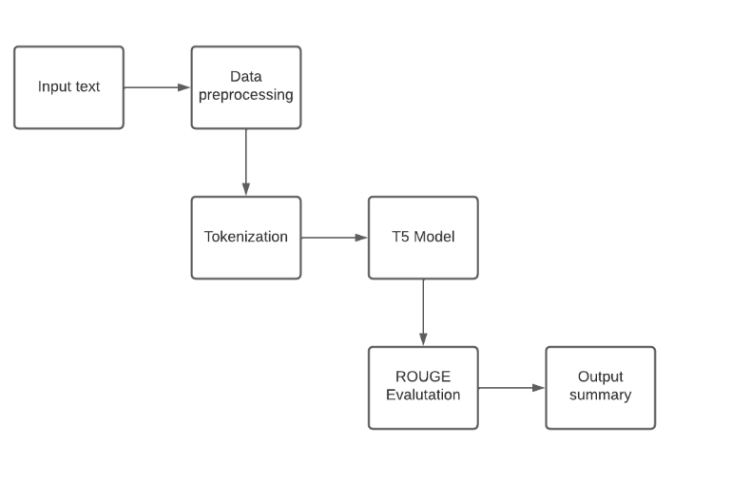

# Text Summarization using T-5 model

This repository contains the code and resources for a text summarization project using the T5 Transformer model, a powerful language model capable of understanding and generating human-like text. The project aims to develop an abstractive text summarization system to enhance efficiency, comprehension, and decision-making processes across various domains.

In today's information-rich world, it is crucial to focus on the essential content amidst the overwhelming volume of information available. However, people often spend a significant amount of time sifting through irrelevant details, inadvertently overlooking crucial information. This project addresses this issue by utilizing the T5 transformer model in natural language processing to develop an abstractive text summarization system. By leveraging advanced language modeling techniques, the project aims to condense lengthy text into concise and accurate summaries, capturing the key information and main ideas.

## Dataset

The project utilizes the "multi_news" dataset, available on the HuggingFace library, as a foundational resource for news analysis and summarization tasks. This meticulously curated dataset offers a comprehensive collection of news articles paired with human-written summaries, originally sourced from newser.com, a prominent news aggregation platform.

Structure:

The "multi_news" dataset is structured to facilitate a myriad of natural language processing (NLP) applications, featuring:

Document:
   - This feature column encompasses the complete texts of news articles, with each article delineated by a unique delimiter token |||||, ensuring clear segmentation.
   
Summary:
   - The target column contains concise summaries meticulously crafted by human writers, encapsulating the essence of the corresponding articles.

Utility:

The dataset serves as a pivotal resource for researchers, developers, and enthusiasts delving into NLP-driven tasks such as text summarization, document understanding, and information retrieval. Its comprehensive nature and meticulous curation make it an ideal choice for training and evaluating models aimed at automating the summarization process or extracting key information from vast troves of textual data.

Access:

Developers can seamlessly access the "multi_news" dataset via the HuggingFace library, facilitating easy integration into diverse projects and experimentation with cutting-edge NLP techniques. By harnessing this dataset, developers can unlock new avenues for enhancing news comprehension, automating summarization tasks, and building intelligent systems capable of distilling critical insights from the vast expanse of news content available online.

## Model
For this project, the T5 transformer model was chosen for its effectiveness in sequence-to-sequence tasks. The DataCollatorForSeq2Seq class handles data processing, ensuring proper tokenization and data collation. The model is instantiated with pre-trained T5 weights, making it suitable for tasks such as text summarization, translation, and dialogue generation.

## Architecture

The architecture involves the following steps:

Data Preprocessing: The input data is cleaned, organized, and tokenized for processing.
Model Training: The pre-trained T5 model is fine-tuned on the summarization task using the preprocessed data.
Summarization: The trained model generates concise summaries for new input documents.
Evaluation: The generated summaries are evaluated using the ROUGE metric, which measures the similarity between the generated summaries and human-written summaries.

## Tech Stack

## Authors

- [@codekid211](https://github.com/codekid211)
- [@RatanRavichandran](https://github.com/RatanRavichandran)
- [@Shriyans]

## Results
National Archives Yes, it's that time again, folks. It's the first Friday of the month, when for one ever-so-brief moment the interests of Wall Street, Washington and Main Street are all aligned on one thing: Jobs. A fresh update on the U.S. employment situation for January hits the wires at 8:30 a.m. New York time offering one of the most important snapshots on how the economy fared during the previous month. Expectations are for 203,000 new jobs to be created, according to economists polled by Dow Jones Newswires, compared to 227,000 jobs added in February. The unemployment rate is expected to hold steady at 8.3%. Here at MarketBeat HQ, we'll be offering color commentary before and after the data crosses the wires. Feel free to weigh-in yourself, via the comments section. And while you're here, why don't you sign up to follow us on Twitter. Enjoy the show. ||||| Employers pulled back sharply on hiring last month, a reminder that the U.S. economy may not be growing fast enough to sustain robust job growth. The unemployment rate dipped, but mostly because more Americans stopped looking for work. The Labor Department says the economy added 120,000 jobs in March, down from more than 200,000 in each of the previous three months. The unemployment rate fell to 8.2 percent, the lowest since January 2009. The rate dropped because fewer people searched for jobs. The official unemployment tally only includes those seeking work. The economy has added 858,000 jobs since December _ the best four months of hiring in two years. But Federal Reserve Chairman Ben Bernanke has cautioned that the current hiring pace is unlikely to continue without more consumer spending

Generated summary
The economy isn't growing fast enough to sustain robust job growth, but it's not growing fast enough to sustain robust job growth. The Labor Department says the economy added 120,000 jobs in March, down from more than 200,000 in each of the previous three months, the lowest since January 2009. The unemployment rate dropped to 8.2%, the lowest since January 2009. The economy has added 120,000 jobs in March, down from more than 200,000 in each of the previous three months, the Labor Department says. The unemployment rate fell to 8.2%, the lowest since January 2009.

## Conclusions and Future Work
The potential applications of this text summarization technology are vast, with the ability to revolutionize how we interpret and utilize textual data across various fields, thereby increasing accessibility and effectiveness. Looking ahead, two key areas for future improvement have been identified:

Domain-Specific Tailoring: Fine-tuning and adapting the model to specific domains or industries, enabling more precise and contextually relevant summaries.
Multi-Document Summarization: Integrating models that can summarize multiple related documents, generating coherent summaries from various sources.

## Installation
To set up and run this project locally, follow these steps:

1. Clone the repository:
  '**git clone https://github.com/codekid211/Text Summarization Using T-5**'

2. To generate summary
   '**pyhton filename.py**'

## Contribution
Contributions to this project are welcome. If you find any issues or have suggestions for improvements, please open an issue or submit a pull request.